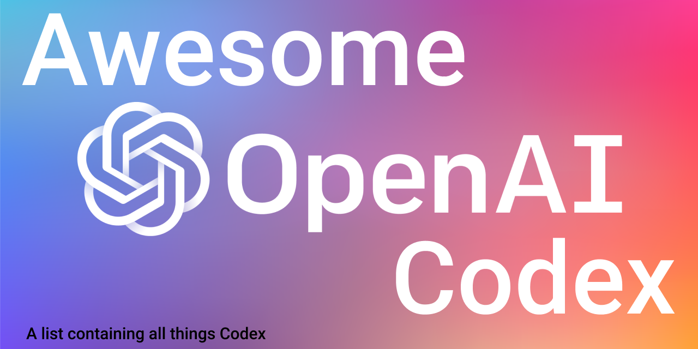

# Awesome OpenAI Codex
A list dedicated to products, demos and articles related to 🤖 OpenAI's [Codex](https://openai.com/blog/openai-codex/).
Happy exploring 🧭!

* [OpenAI API](https://beta.openai.com/playground)
* [OpenAI Codex Javascript Sandbox](https://beta.openai.com/codex-javascript-sandbox)

  
Also check out [awesome GPT3](https://github.com/elyase/awesome-gpt3), for a list of GPT3 demos and products.

## Contributing
Feel free to open a PR adding any relevant links to articles, tweets, repos, videos, etc...  

Any questions? Message me on [Twitter](https://twitter.com/KarelDoostrlnck).

## Demos

### Data science
* [Data science with OpenAI Codex](https://www.youtube.com/watch?v=Ru5fQZ714x8&list=PLOXw6I10VTv_FhQbbvYh1FvbiaPf43Ve2&index=4)
* [Interactive data analysis notebook](https://twitter.com/mick_ver/status/1433007625013186564)
* [Writing a neural network in Python](https://twitter.com/lxuechen/status/1431473450351161350)
* [Writing a Hugginface sentimental analysis model](https://twitter.com/osanseviero/status/1438747036254449667)

### Manipulating programs using natural language
* [Manipulate Word documents with Codex](https://www.youtube.com/watch?v=-Dpl2awseZU&list=PLOXw6I10VTv_FhQbbvYh1FvbiaPf43Ve2&index=5)
* [Using Codex to make scenes with Blender](https://twitter.com/andrew_n_carr/status/1425507697277865987)

### Code generation, manipulation & understanding
* [Converting Python to Ruby with OpenAI Codes](https://www.youtube.com/watch?v=Iq3rDFZOorw&list=PLOXw6I10VTv_FhQbbvYh1FvbiaPf43Ve2&index=6)
* [Explain Assembly](https://twitter.com/CristiVlad25/status/1432017112885833734)
* [Code synthesis from unit tests](https://twitter.com/narphorium/status/1432883931053846536)
* [Generating SQL queries 1](https://twitter.com/mustafaergisi/status/1432686105082613764)
* [Generating SQL queries 2](https://twitter.com/rishdotblog/status/1426131270313005063)
* [Refactoring tool](https://twitter.com/ColemanHindes/status/1425225551451668480)
* [Generating Bash scripts](https://twitter.com/CristiVlad25/status/1430111553387442182)
* [Using Codex to find a bug in C++ code](https://twitter.com/albertvaka/status/1428138127198130176)
* [Writing a web scraper](https://twitter.com/harishkgarg/status/1425816754391961605)

### Front-end/UI/UX
* [Generating SwiftUI](https://twitter.com/mralexhay/status/1433517706360377346)
* [Generating three.js code](https://twitter.com/brianpeiris/status/1426358750684880896)
* [Creating a login form using Codex](https://twitter.com/slava__bobrov/status/1425884862863618058)
* [Creating a React component](https://twitter.com/mckaywrigley/status/1425279724222251016)
* [Writing tailwindcss code](https://twitter.com/altryne/status/1425501736526090245)
* [Combining GPT3 and Codex to generate web apps](https://twitter.com/sharifshameem/status/1425185575645024256)
* [Figma digital assistant](https://twitter.com/jsngr/status/1429906666875588620)

### Games
* [Creating a space game with OpenAI Codex](https://www.youtube.com/watch?v=Zm9B-DvwOgw&list=PLOXw6I10VTv_FhQbbvYh1FvbiaPf43Ve2&index=3)

### Miscellaneous 
* [Giving OpenAI Codex a First Grade Math Test](https://www.youtube.com/watch?v=fRyTycXMlzA&list=PLOXw6I10VTv_FhQbbvYh1FvbiaPf43Ve2&index=7)

### Products & tools
* [Github Copilot](https://copilot.github.com)
* [Cogram.ai - data science code assistant](https://twitter.com/gdb/status/1435269195248414721)
* [Figstck - VSCode extention for documenting code](https://twitter.com/FigstackApp/status/1432782356117655558)
* [Streamlit & Codex - Analyse data using plain English](https://twitter.com/writepy/status/1429807673919295494)
* [Airgift - Manipulate 3D and AR content using Codex](https://twitter.com/HeySaiK/status/1429791743558307845)
* [Anteam - Extracting insights from data](https://twitter.com/aryxnsharma/status/1426545605837426688)
* [Auto-docstring - adds Python docstrings to your functions](https://twitter.com/scottleibrand/status/1430753899460194310)
* [Vim Codex - Enables access to Codex from within Vim](https://github.com/tom-doerr/vim_codex)
* [Replit - JaveScript code explainer](https://blog.replit.com/codex)
* [Codex Readme - Readme generator](https://github.com/tom-doerr/codex-readme)
* [Zsh Codex - AI in the command line](https://github.com/tom-doerr/zsh_codex)

### Repositories
* [Computational chemistry natural language command line interface](https://github.com/whitead/nlcc)
